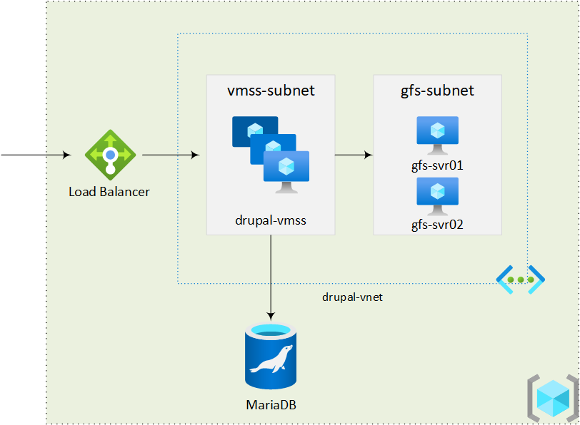

# Deploy Drupal on Azure VMSS with Ansible

The Ansible playbooks in this repo helps to automatically deploy a testing environment for Drupal sites based on Azure VMSS.

## What the playbooks do

The playbooks deploy and configure the following components and services.

- A virtual network with 2 subnets, one for VMSS and another for GlusterFS cluster.
- A 2 nodes GlusterFS cluster.
- An Azure Database for MariaDB.
- A VMSS with a load balancer. The servers in VMSS are configured with the following roles:
  - GlusterFS client with the gluster volume mounted.
  - PHP, Drupal and Nginx.

The diagram below shows how the deployed environment would look like.

## How to use it

- Configure your Ansible control node to work with Azure. See this [Document](https://docs.microsoft.com/azure/developer/ansible/install-on-linux-vm).
- On the Ansible control node, `git clone https://github.com/chunliu/drupal-vmss-ansible.git`.
- Update the value of variables in `src/group_vars/all.yml`.
- Run the playbooks one by one with `ansible-playbook`.

## Credits

The playbooks are built on top of the awesome work in the following repos. Thanks to their authors.

- <https://github.com/liptanbiswas/drupal-ansible> for deploying Drupal on VM with Ansible.
- <https://github.com/Azure/azure-quickstart-templates/tree/master/301-drupal8-vmss-glusterfs-mysql> for the bash script of deploying Drupal on VMSS.
